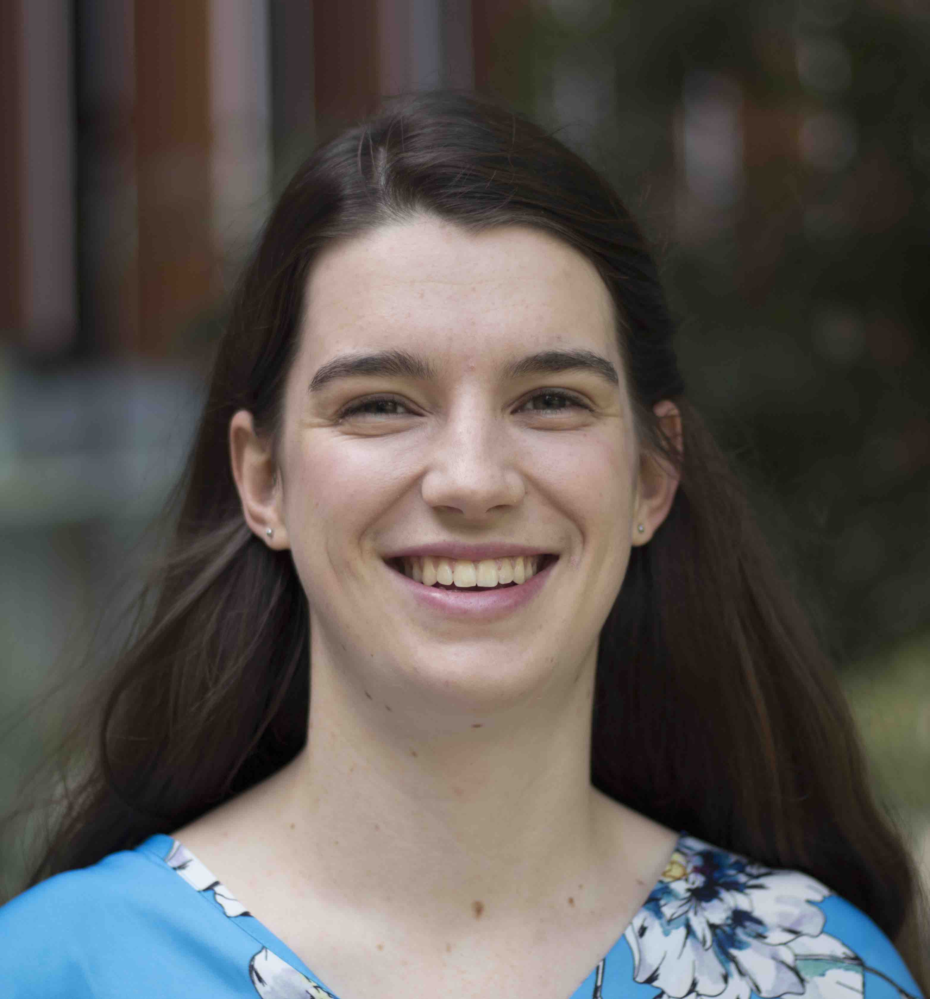

I am a PhD student in the [topology group](https://www.maths.ox.ac.uk/groups/topology) at the University of Oxford, supervised by [Marc Lackenby](http://people.maths.ox.ac.uk/lackenby/).

I study how the geometric or topological structures on three-manifolds interact with minimal triangulations of them.
I am also interested in how Morse structures on surfaces can inform us about the mapping class group.

My email is [firstname].[lastname]@maths.ox.ac.uk.

Before this, I worked at the Machine Learning Research Group, Data61, CSIRO in Australia, after completing my undergraduate degree at the Australian National University.

### Places you might see me
- MATRIX/Oberwolfach Workshop on Invariants and Structures in Low-Dimensional Topology, September 2021
- Nearly Carbon Neutral Geometry and Topology Conference, June 2021

<iframe src="https://drive.google.com/file/d/1rBSK-RpvHIh5lJUbmuUpR41mBBY6u-9J/preview" width="640" height="480" allow="autoplay"></iframe>

