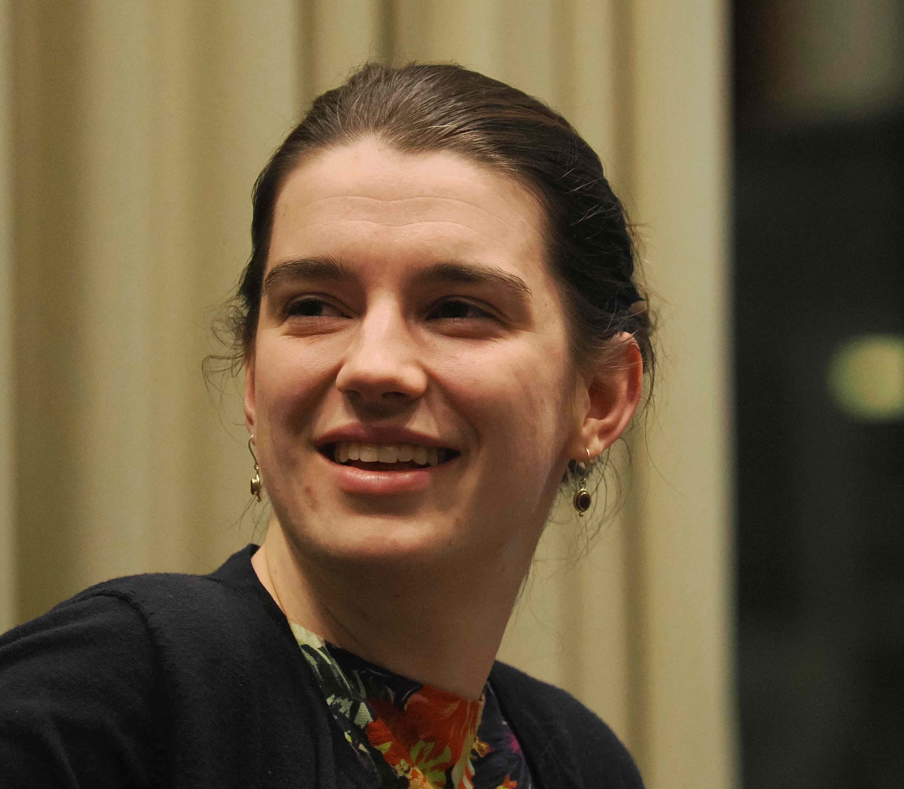

I am a PhD student in the [topology group](https://www.maths.ox.ac.uk/groups/topology) at the University of Oxford, supervised by [Marc Lackenby](http://people.maths.ox.ac.uk/lackenby/). I expect to defend my thesis in early 2024.

I am broadly interested in low-dimensional topology, geometric group theory and algorithms.
I am currently working on algorithms around Seifert fibered spaces.

My CV can be found [here](files/AJackson_CV.pdf) (last updated October 2023).

My email is [firstname].[lastname]@maths.ox.ac.uk.

<a
    id="cy-effective-orcid-url"
    class="underline"
     href="https://orcid.org/0000-0002-8666-2827"
     target="orcid.widget"
     rel="me noopener noreferrer"
     style="vertical-align: top">
     
      https://orcid.org/0000-0002-8666-2827
    </a>

### Preprints and papers
- __Recognition of Seifert fibered spaces with boundary is in NP.__ [(author's version)](papers/AJackson_SFS_recognition_with_boundary.pdf) [(arXiv:2306.04612)](https://arxiv.org/abs/2306.04612)
- __Minimal triangulation size of Seifert fibered spaces with boundary.__ [(author's version)](papers/AJackson_SFS_Triangulation_bound.pdf) [(arXiv:2301.02085)](https://arxiv.org/abs/2301.02085) [(extended abstract from Oberwolfach talk)](https://publications.mfo.de/handle/mfo/4015)
- _with Jack Brand, Benjamin A. Burton, Zsuzsanna Dancso, Alexander He, and Joan Licata._ __Arc diagrams on 3-manifold spines.__ *Discrete Comput. Geom.* (2023) [(journal version)](https://link.springer.com/article/10.1007/s00454-023-00539-4) [(arXiv:2202.02007)](https://arxiv.org/abs/2202.02007)

### Recent travel
- *Group Actions and Low-Dimensional Topology*, El Barco de Ávila, July 2023
- *International Young Seminar on Bounded Cohomology and Simplicial Volume*, June 2023
- *Around 3-manifold groups*, Montréal, June 2023
- *Computational problems in low-dimensional topology III*, Rutgers-Newark, April 2023
- *AGATA seminar*, University of Warwick, March 2023
- *Geometry and Topology seminar*, University of Bristol, March 2023
- *Young geometric group theory XI*, Münster, February 2023
- *Geometry and Topology seminar*, Université du Luxembourg, February 2023
- *Low-dimensional topology*, Oberwolfach, January 2023
